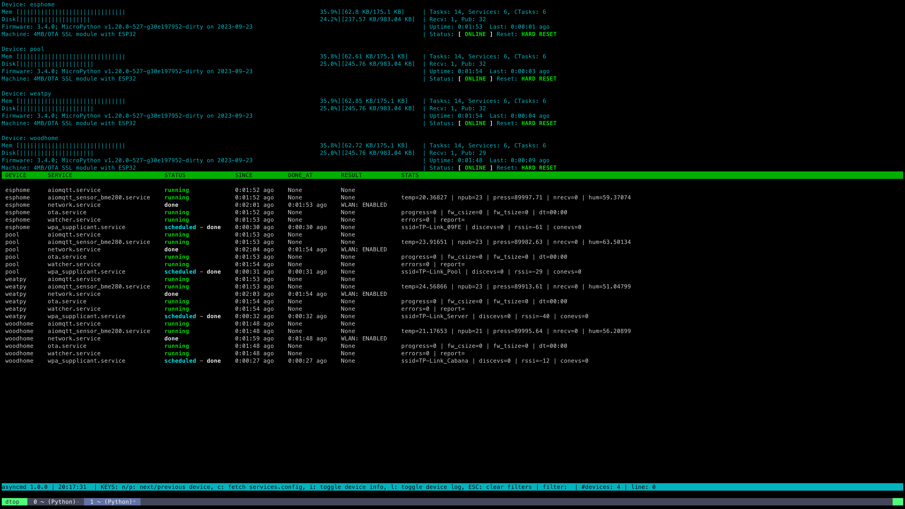

## Asyncmd CLI

Intended to be a tool for managing, monitoring and debugging devices over MQTT, it expects devices using `aiomqtt.service` and `watcher.service` at least.

### Install

Install with (if cwd is `asyncmd/cli`)
```bash
pip install .
```
or 
```bash
pip install cli/
```
if in top level directory

### Usage

The `asyncmd` CLI tool has several commands:

* `pub`: publish a message to one or more topics.
* `sub`: subscribe to one or more topics.
* `ota`: perform an OTA firmware update.
* `otasrv`: start the asynchronous OTA server.
* `sha`: check the SHA256 hash of the device's current application firmware.
* `services`: list available aioservices.
* `dtop`: display the status of one or more devices aioservices with a htop-like UI.
* `devconfig`: get or set device configuration options.
* `config`: configure default settings for the `asyncmd` CLI.

There is also several optional arguments:

* `-h, --help`: show this help message and exit.
* `-v`: show program's version number and exit.
* `-c`: check config file.
* `--conf CONF`: config file to use, default: `~/.asyncmd/asyncmd.config`.
* `--dconf [DCONF ...]`: config options for devconfig, options: `[get, set, enable, disable]`.
* `--args [ARGS ...]`: arguments for devconfig.
* `--kwargs KWARGS`: kwargs for devconfig.
* `-sub SUB`: override subscription topic.
* `-ht HT`: host.
* `-p P`: port.
* `-t T`: topic.
* `-m M`: message.
* `-d D`: device.
* `-ff [FF ...]`: firmware file/s, default: `[micropython.bin]`.
* `--cafile CAFILE`: CA cert.
* `--key KEY`: client key.
* `--cert CERT`: client cert.
* `--ota-cafile OTA_CAFILE`: OTA server CA cert.
* `--ota-key OTA_KEY`: OTA server key.
* `--ota-key-pph OTA_KEY_PPH`: OTA server key passphrase.
* `--ota-cert OTA_CERT`: OTA server cert.
* `-f [F]`: Force default configuration of any argument.
* `-nl`: disable logging for devconfig cmd.
* `-dflev DFLEV`: debug file mode level, options `[debug, info, warning, error, critical]`.
* `-dslev DSLEV`: debug sys out mode level, options `[debug, info, warning, error, critical]`.


### dtop 

This is the default mode, and it is a TUI inspired by htop.





#### Keybindings 

    n/p: next/previous device
    N/P: next/previous page
    0: all devices
    j/k, }/{, space/g , arrow down/up: scroll down/up command output
    arrow left/right, h/l: scroll left/right services info
    i: toggle device info
    H: toggle services info
    e: toggle service cursor
    enter/d: debug service if service cursor is enabled
    s: get stats of service if service cursor is enabled
    r: get report of service if service cursor is enabled
    TAB: select next service
    S-TAB: select previous service
    f: set last device filter
    c: fetch and toggle device config info
    L: fetch and toggle device log
    t: switch time format (ISO/DATETIME)
    ESC: clear filters and cmd mode output
    TAB (in command line): autocompletion of
         commands, devices, services and files
    q: exit


It has 3 sections and a command line at the bottom.

#### Top section: Device info

This shows device/s state info and can be toggled with `i` key.

#### Middle Section: Services info 

This shows device/s services state/stats and be toggled with `H` key.

#### Bottom Section: Command output 

* Any command output like config, logging, debug etc will be shown here.
* For output navigation use keys `j/k, }/{, space/g ` which will scroll down/up command output at a different pace.
* Press `esc` key to clean command output.


#### Command Line

* Keybindings: `:`, `@`, `/`, `%`, `$`, `?`

Each one of this will enable different command line modes.

usage:

    :command [options] --> local commands
    @command [options] --> device commands
    /pattern* --> filter by device name (accepts * wildcards)
    %pattern* --> filter log by pattern
    $pattern* --> filter service info by pattern
    ?command --> see help of command
    @help --> see device commands help
    @?command --> see help of device command


```
asyncmd CLI tool

[command] -h or ?[command]/@?[command] to see further help of any command

options:
  -h, --help            show this help message and exit

commands:
  Available commands

  {start,stop,stats,debug,report,traceback,enable,disable,config,wconf,e,reset,errlog,nd,q}
    start               start async tasks or services
    stop                stop async tasks or services
    stats               get stats of a service
    debug               get debug info of a service
    report              get report info of a service
    traceback           get traceback info of a service
    enable              enable one or more services
    disable             disable one or more services
    config              config args and kwargs of a service
    wconf               save/write device config in a file
    e                   edit a file with $EDITOR
    reset               reset device/s
    errlog              get device/s error.log
    nd                  devices per page
    q                   exit
```
